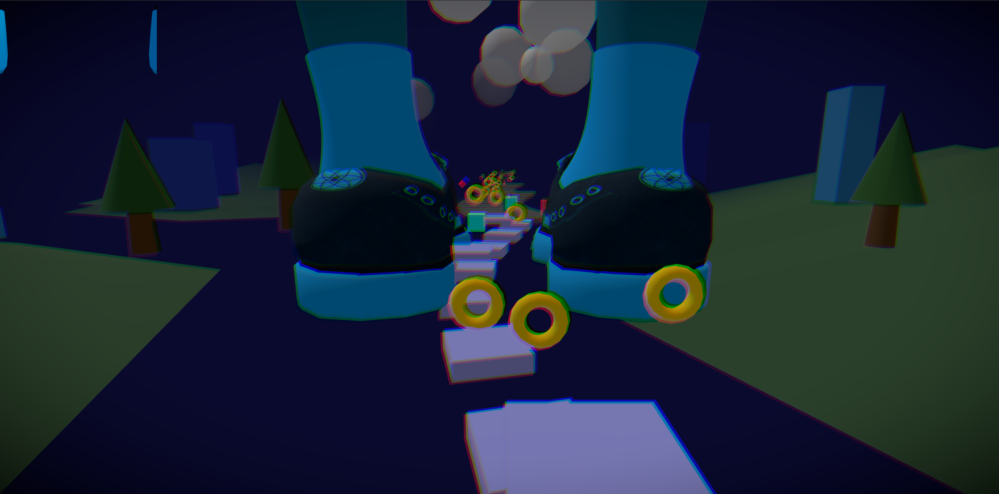

# 3D Rushy Runner



A high-speed, Sonic-inspired 3D infinite runner built with **React**, **Three.js**, and **Zustand**. Experience fast-paced highway adventure with advanced movement mechanics, procedural level generation, and a classic ring-based health system.

## 🚀 Features

- **Advanced Movement:** Jump, Double Jump, Dash, Slide, Wall Jump, and Roll for fluid traversal.
- **Infinite Highway:** Procedurally generated road chunks and backgrounds for an endless experience.
- **Sonic-Style Health:** Collect rings to protect yourself. Losing rings saves you from lethal hits.
- **Ability System:** Unlock and use special abilities like Magic Burst to overcome obstacles.
- **Enemy AI:** Face various enemy types with unique behaviors.
- **Customization:** Shop for abilities and customize your character.
- **Performance Optimized:** Built-in performance scaling and object pooling for smooth gameplay.

## 🛠️ Tech Stack

- **Framework:** [React 18](https://reactjs.org/)
- **3D Engine:** [React Three Fiber](https://docs.pmnd.rs/react-three-fiber) & [Three.js](https://threejs.org/)
- **State Management:** [Zustand](https://github.com/pmndrs/zustand)
- **Styling:** [Tailwind CSS](https://tailwindcss.com/)
- **Audio:** [Howler.js](https://howlerjs.com/)
- **Build Tool:** [Vite](https://vitejs.dev/)

## 🎮 Controls

| Action | Key |
| :--- | :--- |
| **Move** | `W`, `A`, `S`, `D` / Arrow Keys |
| **Jump** | `Space` / `Arrow Up` |
| **Dash** | `Left Shift` |
| **Slide** | `Left Control` / `Arrow Down` |
| **Roll** | `R` |
| **Double Jump** | `F` |
| **Ability 1** | `Q` |
| **Ability 2** | `E` |
| **Magic Burst** | `X` |
| **Pause** | `Escape` |

## 📦 Installation & Setup

1. **Clone the repository:**
   ```bash
   git clone https://github.com/Justin21523/3d-rushy-runner.git
   cd 3d-rushy-runner
   ```

2. **Install dependencies:**
   ```bash
   npm install
   ```

3. **Start development server:**
   ```bash
   npm run dev
   ```

4. **Build for production:**
   ```bash
   npm run build
   ```

## 📜 License

This project is licensed under the MIT License.
